# PROYECTO REDES 1

## Configuraciones

## Topología 1
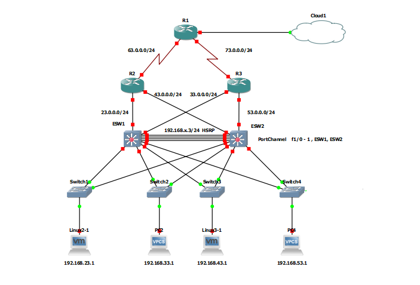


## Tabla  

|Direcciond de Red|Primera Dirección Asignable|Ultima Dirección Asignable|Direccion de Broadcast|
|----------------:|--------------------------:|-------------------------:|--------------------:|
| 192.168.23.0/24 | 192.168.23.1              | 192.168.23.254           |192.168.23.255       |
| 192.168.33.0/24 | 192.168.33.1              | 192.168.33.254           |192.168.33.255       |
| 192.168.43.0/24 | 192.168.43.1              | 192.168.43.254           |192.168.43.255       |
| 192.168.53.0/24 | 192.168.53.1              | 192.168.53.254           |192.168.53.255       |
| 63.0.0.0/24     | 63.0.0.1                  | 63.0.0.254               |63.0.0.255           |
| 73.0.0.0/24     | 73.0.0.1                  | 73.0.0.254               |73.0.0.255           |
| 23.0.0.0/24     | 23.0.0.1                  | 23.0.0.254               |23.0.0.255           |
| 43.0.0.0/24     | 43.0.0.1                  | 43.0.0.254               |43.0.0.255           |
| 33.0.0.0/24     | 43.0.0.1                  | 33.0.0.254               |33.0.0.255           |
| 53.0.0.0/24     | 53.0.0.1                  | 53.0.0.254               |53.0.0.255           |

## Host

| Host  | Conectado a | Dirección IP  | VLAN  | Virtualizada |
|------:|------------:| -------------:|-----: |-------------:|
| Linux | Switch1     | 192.168.23.1  |   23  |      SI      |
| Linux | Switch2     | 192.168.33.1  |   33  |      SI      |
| Linux | Switch3     | 192.168.43.1  |   43  |      SI      |
| Linux | Switch4     | 192.168.53.1  |   53  |      SI      |

### VTP

### Vtp servidor
Para configurar vtp como servidor escribirmos los siguientes comando en la consola del ESW1.
```sh
ESW1#vlan database
ESW1(vlan)#vtp domain T1GRUP13
ESW1(vlan)#vtp password T1GRUPO13
ESW1(vlan)#vtp v2-mode
ESW1(vlan)#vtp server
ESW1(vlan)#exit
```

### Vtp client
Para configurar vtp como cliente escribirmos los siguientes comando en la consola del ESW2.
```sh
ESW2#vlan database
ESW2(vlan)#vtp domain T1GRUPO13
ESW2(vlan)#vtp password T1GRUP13
ESW2(vlan)#vtp v2-mode
ESW2(vlan)#vtp client
ESW2(vlan)#exit
```

```sh
ESW1#sh vtp status
```
#### Resultado
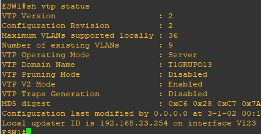

# Configurar los modos de acceso y/o troncal en ESW1,ESW2 


## MODO TRUNCAL

```sh
ESW1#conf t
ESW1(config)#interface range f1/0 - 15
ESW1(config-if-range)#switchport mode trunk
ESW1(config-if-range)#exit
ESW1(config)#exit
ESW1#
```

```sh
ESW2#conf t
ESW2(config)#interface range f1/0 - 15
ESW2(config-if-range)#switchport mode trunk
ESW2(config-if-range)#exit
ESW2(config)#exit
ESW2#
```


### VLAN
# Creacion de VLAN 23,33,43,53
,Para crear vlan se ingresan los siguientes comando en la cosola del ESW1.
```sh
ESW1#vlan database
ESW1(vlan)#vlan 23 name RED1
ESW1(vlan)#vlan 33 name RED2
ESW1(vlan)#vlan 43 name RED3
ESW1(vlan)#vlan 53 name RED4
ESW1(vlan)#exit
```
Para verificar que todas las vlans se crearón ingresamos  el siguiente comando.
```sh
ESW1#show vlan-switch
```
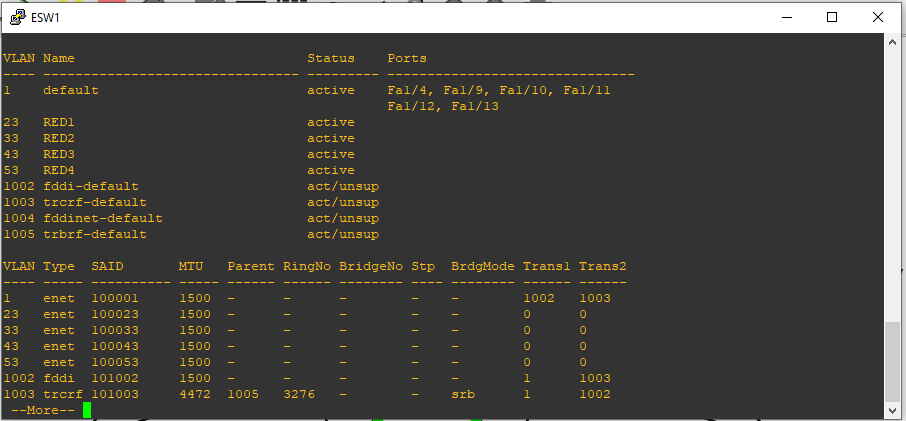


### Protocolos HSRP 

### SwitchEthernet 1
```sh
ESW1#conf t
ESW1(config-if)#int vlan 23
ESW1(config-if)#standby 1 ip 192.168.23.3
ESW1(config-if)#standby 1 priority  200
ESW1(config-if)#standby 1 preempt  delay minutes 5
ESW1(config-if)#end
ESW1#
```
```sh
ESW1#conf t
ESW1(config-if)#int vlan 33
ESW1(config-if)#standby 1 ip 192.168.33.3
ESW1(config-if)#standby 1 priority  200
ESW1(config-if)#standby 1 preempt  delay minutes 5
ESW1(config-if)#end
ESW1#
```

```sh
ESW1#conf t
ESW1(config-if)#int vlan 43
ESW1(config-if)#standby 1 ip 192.168.43.3
ESW1(config-if)#standby 1 priority  200
ESW1(config-if)#standby 1 preempt  delay minutes 5
ESW1(config-if)#end
ESW1#
```
```sh
ESW1#conf t
ESW1(config-if)#int vlan 53
ESW1(config-if)#standby 1 ip 192.168.53.3
ESW1(config-if)#standby 1 priority  200
ESW1(config-if)#standby 1 preempt  delay minutes 5
ESW1(config-if)#end
ESW1#
```


### SwitchEthernet 2

```sh
ESW2#conf t
ESW2(config-if)#int vlan 23
ESW2(config-if)#standby 1 ip 192.168.23.3
ESW2(config-if)#standby 1 priority 150
ESW2(config-if)#standby 1 preempt  delay minutes 5
ESW2(config-if)#end
ESW2#
```
```sh
ESW2#conf t
ESW1(config-if)#int vlan 33
ESW2(config-if)#standby 2 ip 192.168.33.3
ESW2(config-if)#standby 2 priority  150
ESW2(config-if)#standby 2 preempt  delay minutes 5
ESW2(config-if)#end
ESW2#
```

```sh
ESW1#conf t
ESW1(config-if)#int vlan 43
ESW1(config-if)#standby 2 ip 192.168.43.3
ESW1(config-if)#standby 2 priority  150
ESW1(config-if)#standby 2 preempt  delay minutes 5
ESW1(config-if)#end
ESW1#
```
```sh
ESW1#conf t
ESW1(config-if)#int vlan 53
ESW1(config-if)#standby 2 ip 192.168.53.3
ESW1(config-if)#standby 2 priority  150
ESW1(config-if)#standby 2 preempt  delay minutes 5
ESW1(config-if)#end
ESW1#
```

### Port-Channel
Crear port-channel
Para crear port-channel entre

Po1: ESW1 Y ESW2

```sh
ESW1#conf t
ESW1(config)#interface range f1/0 - 2
ESW1(config-if-range)#channel-group 1 mode on
ESW1(config-if-range)#exit
ESW1(config)#exit
ESW1#

ESW2#conf t
ESW2(config)#interface range f1/0 - 1
ESW2(config-if-range)#channel-group 1 mode on
ESW2(config-if-range)#exit
ESW2(config)#exit
ESW2#
```

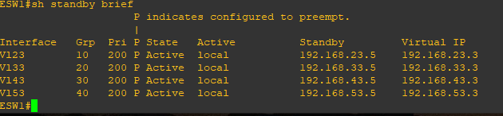

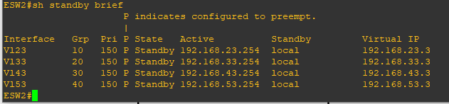

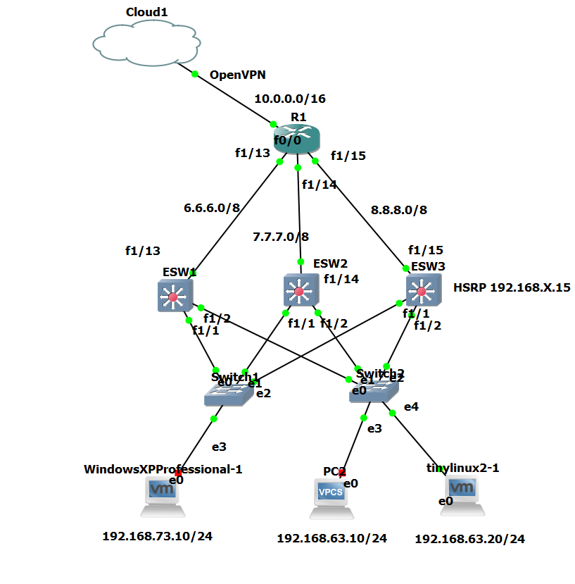


|   Host    | Conectado a |  Dirección IP  | VLAN  | Virtualizada|
|----------:|------------:| -------------: |------:|------------:|
| WindowsXP | Switch1     | 192.168.73.10  |   73  |      SI     |
|   Linux   | Switch2     | 192.168.63.10  |   63  |      SI     |
|   Linux   | Switch2     | 192.168.63.20  |   63  |      SI     |

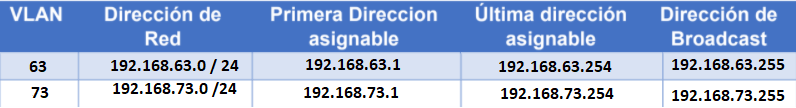

### VTP 
Modo Server en ESW2:

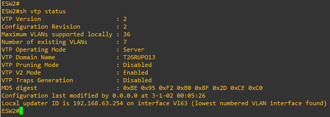

### VTP 

Modo Cliente 1 en ESW1


### VTP 

Modo Cliente 2 en ESW3

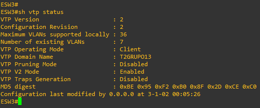

### VLAN 63 y 73

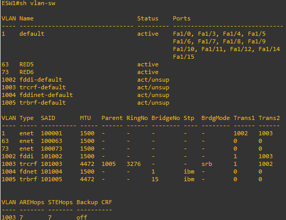

### Enrutamiento

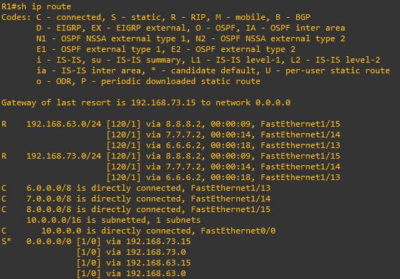

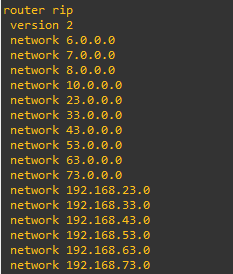

### Protocolo HSRP
ESW1:

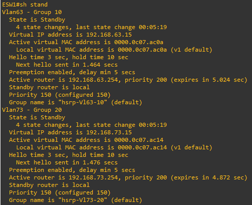

ESW2:

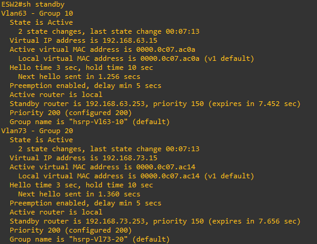

ESW3:

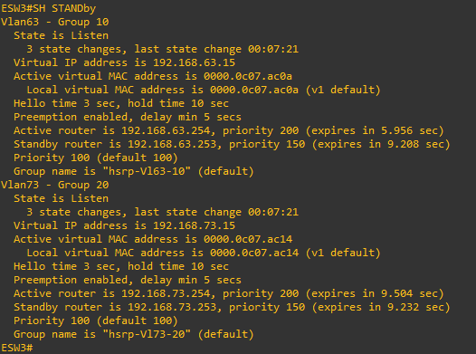
=======


